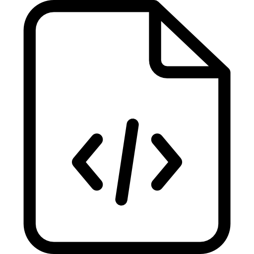

<!--
  Editable page copy for the Arbiter visualiser.

  Each block below is keyed by a `## key` heading that matches a data-md="key"
  attribute in index.html. The loader in index.html fetches this file, splits on
  the `## key` headings, and injects each block's text into the matching element.

  Formatting: **bold**, *italic*, and `code` work. Raw inline HTML is also
  passed through untouched (used for the ARBITER acronym's per-letter bold and
  the coloured "Accepted"), so you can keep or edit those tags directly.

  Edit the prose freely; do NOT rename the `## keys` (they wire to the page).
-->

## title
Arbiter: Sample-Efficient Test-Time Scaling with an Agentic Verifier

## teaser-cap
**gpt-oss-120b, refined against Arbiter, clears the IOI 2026 gold-medal line.** Contest score (/600) versus **k**, the candidates drawn per subtask — Arbiter-gated refinement beats plain score@k at every budget, and the gap is widest where samples are scarce. Hover for exact values.

## verifier
Prior attempts at IOI-level competitive programming scale test-time compute in parallel: overgenerate, then search. <a href="https://storage.googleapis.com/deepmind-media/AlphaCode2/AlphaCode2_Tech_Report.pdf" target="_blank" rel="noopener">AlphaCode</a> drew up to a million candidate programs per problem and distilled them to ten submissions with filtering and clustering. OpenAI's <a href="https://arxiv.org/abs/2502.06807" target="_blank" rel="noopener">o1-ioi</a> sampled 10,000 solutions per subtask at IOI 2024, then picked 50 with clustering and a learned reranker. NVIDIA's <a href="https://arxiv.org/abs/2510.14232" target="_blank" rel="noopener">GenCluster</a> reached the IOI 2025 gold line with an open-weight model by drawing 5,000 solutions per subtask from gpt-oss-120b — the same solver we refine — and selecting 50 through behavioral clustering and a tournament. The paradigm works, but every sample is drawn blind, and each verdict spends one of the 50 submissions a contestant is allowed. How can we do better than search?
  
**Arbiter** (<b>A</b>gentic <b>R</b>einforcement-learned <b>B</b>ug-finding <b>I</b>nteractive <b>T</b>est <b>E</b>xamine<b>R</b>) supplies the missing feedback. It reads the problem and one candidate, decides Accept or Reject, and on rejection returns a diagnosis plus a concrete input that breaks the code. A solver refining against that signal does not redraw from scratch; it corrects its prior mistake, so test-time compute scales with the depth of a revision chain rather than the width of a sample pool. 

## environment
Beyond IOI, Arbiter is an example of **environment engineering**. A typical coding environment is built to ensure correctness and nothing more: it scores what the model did, and the score is where the interaction ends. We design the environment to also carry signal — every rejection arrives with a diagnosis and a replayable counterexample, so the model has something concrete to improve from. And because that feedback comes from the verifier rather than the judge, querying it spends no submissions and exposes no hidden tests. The same signal can drive RL training and test-time refinement alike.

## training
**Base model & RL loop.** Arbiter is trained from **Qwen3.6-35B-A3B** with **GRPO**-style group-normalized advantages in an asynchronous agentic-RL loop. The verifier is trained in a sandbox environment with two tools (`execute_code`, `execute_command`) and no judge access. It can compile the candidate code solution and probe it on inputs of its own devising, but must commit to a verdict on its own evidence. Adjudication happens only after the episode ends, when the candidate is re-hosted on a live judge and the submitted hack is replayed against it. This keeps the training signal unmetered and leak-free.
  
**Training data.** We mine training data from a strong solver's RL rollouts and sample it down to **20K submissions across 6,145 problems** under a score-stratified quota. The near-miss band (score 76–99) gets the largest share at **40%**, since a solution that fails a single subtask cannot be broken by a careless input and forces the verifier to actually read the code. Every label is a live judge verdict. The pool is deduplicated by code content, capped per problem, and kept disjoint from every evaluation problem, with a separate hard validation set (100 problems, 400 candidates) to pick checkpoints.
  
**Reward design.** Every Arbiter output includes a verdict (AC/no-AC), a diagnosis and a hack. Rewarding only the verdict makes the reward easily gamable due to label imbalance, and the model quickly degenerates. Rewarding the diagnosis is hard due to its free-form text nature. Thus our reward heavily relies on the verifiability of the hack.

## training-funnel
The reward is a **layered funnel** built to make evidence cheaper to produce than to fake. Three-quarters of it sits at the one step that cannot be faked: a validator-legal input that actually breaks the candidate. Guessing "rejected" and submitting garbage therefore caps an order of magnitude below a verified break.
  
**Length penalty.** Late in training, responses balloon until episodes die to timeouts rather than to wrong verdicts. The fix, adopted from Kimi K2.5, is a length penalty applied in alternating phases against a relative budget — the 75th percentile of length within each group's best-reward tier. Under it, response length comes down while reward keeps rising.

## training-cap
**The length penalty shortens responses without costing reward.** One run continued two ways from the same checkpoint, differing only in whether a length penalty is applied over three windows (shaded, steps 90–109 / 160–179 / 230–249). Under the penalty (vermillion), response length falls while mean reward holds — and the abortion ratio (trajectories cut off before finishing) falls too. Solid lines are a 5-step centred moving average; faint lines are the raw per-step values. The baseline (grey) fades out at step 237, where that run's own logging ends — it never reaches the 300-step mark the penalized run runs to.

## results
Apart from the IOI experiments, we also evaluate Arbiter's standalone judging capability on two complementary benchmarks. **UOJ-Bench** is an existing public hacking benchmark: every candidate is known to be wrong (479 Easy / 1,005 Hard), so it probes depth — covert bugs that survive an official test suite. **USACO-Judge** is a benchmark we built from the held-out 2026 USACO contests: 900 candidates (270 Easy / 630 Hard) over 39 problems spanning Bronze through Platinum, balanced at one correct solution for every two wrong ones, so a verifier must accept correct code as well as break wrong code. Candidates come from five model families plus five human competitive programmers, and every label is a live judge verdict on expert-authored validators and checkers.
  
The table ranks models by hack success: the share of wrong candidates broken with a legal generated input, split Easy/Hard on each benchmark, all single-sample. Training does the heavy lifting. On UOJ-Bench Easy, the same 35B backbone breaks **16.7%** of candidates untrained, **41.3%** with an agentic scaffold, and **61.5%** after RL. That places Arbiter **above DeepSeek-V4-Pro, a model 45× its size, on every split**. It trades blows with GLM-5.2 (behind on UOJ-Bench, ahead on USACO-Judge) and posts the best USACO-Judge Easy score in the table at **96.6%**. The strongest closed models, GPT-5.5 and Claude-Opus-4.8, remain ahead; we do not claim otherwise.

## results-cap
**Hack success rate (%)** on UOJ-Bench and USACO-Judge, by difficulty split (Easy / Hard). **↑** higher is better; **bold** = best in column. Grouped by inference mode: non-agentic (⚡, single-shot) versus agentic (⚙, tool-using). Arbiter (35B) rivals models up to ~45× larger.

## refinement
On IOI 2026 itself, gpt-oss-120b revises each candidate against Arbiter's counterexample under a 5-round budget. Capping refinement at round **R** shows how quickly the verifier's feedback pays off.

## refinement-cap
**One round of refinement does most of the work.** The line is contest score when Arbiter-gated refinement is capped at round **R**: it jumps **272.49 → 356.91** from a single counterexample — most of the eventual gain, though not quite gold yet — then reaches **385.46** by R4, clearing gold, and holds there through R5. The bars show how many trajectories are still being sampled each round per subtask — all **50** seeds at R0, dropping to **20** at R1 and just **7** by R5 as accepted solutions leave the pool. Most of the score is banked while the pool is still large.

## artifacts
Every score above is backed by its raw data. Click a subtask to open its fan of 50 trajectories, then any node for the verifier's full turn-by-turn review, or the  icon for the program that round submitted and the reasoning that wrote it. The badge beside a problem's score opens its merged final submission.
